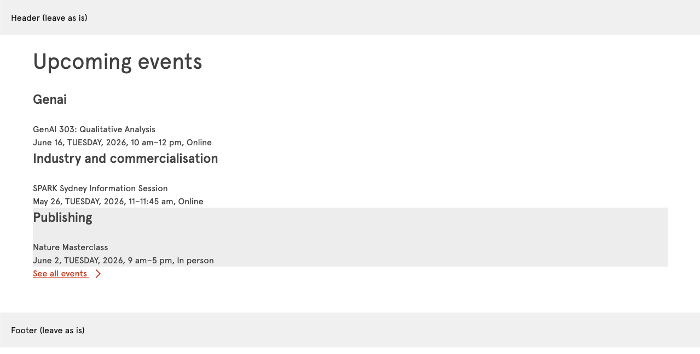
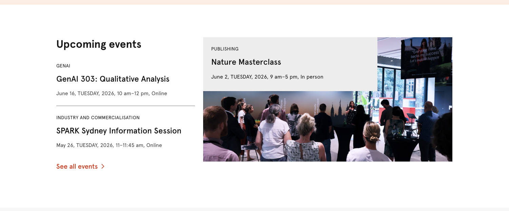
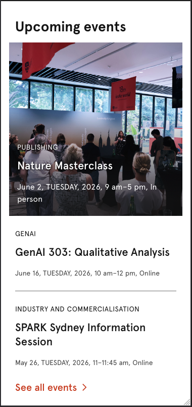

# AEM Frontend Test

## Overview
Create a responsive **News Event Component** that displays a list of upcoming events with a title, date, and description. The component should be reusable and work on both desktop and mobile devices.

## Estimated Time
Try to complete the task within 60–120 minutes. Note any incomplete sections and explain what could be improved given more time.

## Instructions
Build a **News Event Component** using **React** or **Svelte** that consumes data from the provided `data.json` file and displays event information including `category`, `title`, `date`, `time`, and `type`. Use your preferred build tool (e.g. Vite) and styling approach (SCSS, CSS Modules, or plain CSS). The component must be fully responsive across desktop (max-width 1200px) and mobile (breakpoint at 600px), accept data via props/exports (no hardcoded values), and include semantic HTML and accessibility attributes. Focus on clean, maintainable code—prioritise visual balance, responsiveness, and structure over pixel-perfect matching. Document your decisions in the `EXPLAINATION.md` file.

Each item in `data.json` has an `isFeatured` flag. When `isFeatured: true`, the item should be rendered as a **featured card** — a large, prominent section with a full background image (3:2 ratio for desktop, 1:1 ratio for mobile), overlay, and the event details displayed over it. Non-featured items should render as standard list cards. **Only one item may have `isFeatured: true` at a time** — your component should handle this as a constraint, not render multiple featured cards.

A live demonstration can be found [here](https://researcher-hub.sydney.edu.au/events-and-resources.html) — the second component before the footer. Use this as a visual guide for font size, spacing, position, and colour. We encourage you to build your own HTML structure rather than replicating the source code, as this is an opportunity to showcase your coding ability.

**Please complete the `EXPLAINATION.md` file with:**
- Your approach and design decisions
- How you structured your component
- Framework features you used
- Any styling decisions and reasoning
- How you handled responsiveness

**Include in your submission:**
- Setup and build instructions (e.g., `npm install`, `npm run dev`, `npm run build`)
- How to run and view your component
- Any dependencies or environment setup required for running your component

## Prerequisites
Use CORS Unblock browser plugin to load Apercu fonts during development. Verify that the fonts are loaded correctly using `example.html`.

## Design References

### Desktop View

### Mobile View

## Evaluation Criteria

- **Code Quality (40%)** - Clean, readable code structure and proper framework usage
- **Styling (30%)** - Good visual design with responsive implementation and attention to detail
- **Framework Understanding (20%)** - Proper use of React hooks or Svelte reactivity
- **Documentation (10%)** - Clear comments and easy for team members to understand

## Submission

**For Applicants:** Fork this public **Bitbucket** repository to your personal account, clone your fork, create a feature branch named `USYD-frontend-test`, complete your component implementation, and submit a Pull Request from your fork to the main repository. Notify us via email with the PR link as part of your application process along with a complete `EXPLAINATION.md` file, all setup and build instructions, and clear documentation on how to run your component.

## Notes
This test evaluates your front-end development skills, code tidiness, framework knowledge, and practical styling decision vs pixel-perfect matching. We value clean code that teammates will appreciate. Demonstrate your understanding of your chosen framework and write production-ready components.

---

*We recognise and pay respect to the Elders and communities - past, present, and emerging - of the lands that the University of Sydney's campuses stand on. For thousands of years they have shared and exchanged knowledges across innumerable generations for the benefit of all.*

